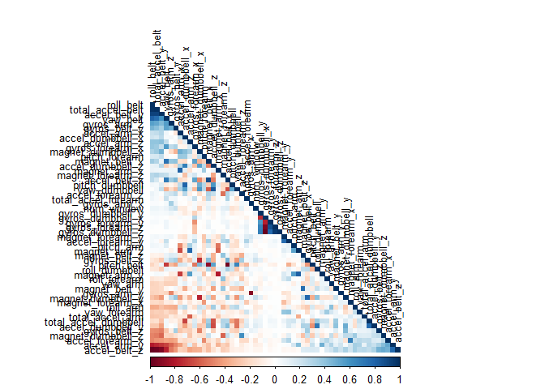
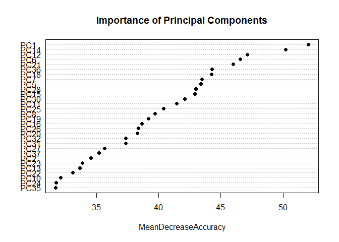

# PML_Course_Project
Mike Crabtree  
February 4, 2017  


## Introduction

While some go about their days ignoring the intricacies of their movements, there are some who seek to quantify and study them.  In this project, your goal will be to use data from accelerometers on the belt, forearm, arm, and dumbell of 6 participants.  The goal of this project is to predict the manner in which they did the exercise.

The data for this project can be found here:

[http://groupware.les.inf.puc-rio.br/har](http://groupware.les.inf.puc-rio.br/har)

## Preparing the Workspace

```r
library(caret)
library(corrplot)
library(randomForest)
library(gbm)
library(survival)
library(splines)
library(parallel)
library(plyr)
```


```r
#Load up the two datasets. Both of them contain blanks that should be NA
train <- read.csv("pml-training.csv", header = TRUE, na.strings = c("NA", ""))
test <- read.csv("pml-testing.csv", header = TRUE, na.strings = c("NA", ""))
```

## Preprocessing the Data for Analysis

Unfortunately, most of the features vectors in the train and test sets are filled with missing values and are of little value.


```r
na_col_sums <- colSums(is.na(train))
na_col_sums
```

```
##                        X                user_name     raw_timestamp_part_1 
##                        0                        0                        0 
##     raw_timestamp_part_2           cvtd_timestamp               new_window 
##                        0                        0                        0 
##               num_window                roll_belt               pitch_belt 
##                        0                        0                        0 
##                 yaw_belt         total_accel_belt       kurtosis_roll_belt 
##                        0                        0                    19216 
##      kurtosis_picth_belt        kurtosis_yaw_belt       skewness_roll_belt 
##                    19216                    19216                    19216 
##     skewness_roll_belt.1        skewness_yaw_belt            max_roll_belt 
##                    19216                    19216                    19216 
##           max_picth_belt             max_yaw_belt            min_roll_belt 
##                    19216                    19216                    19216 
##           min_pitch_belt             min_yaw_belt      amplitude_roll_belt 
##                    19216                    19216                    19216 
##     amplitude_pitch_belt       amplitude_yaw_belt     var_total_accel_belt 
##                    19216                    19216                    19216 
##            avg_roll_belt         stddev_roll_belt            var_roll_belt 
##                    19216                    19216                    19216 
##           avg_pitch_belt        stddev_pitch_belt           var_pitch_belt 
##                    19216                    19216                    19216 
##             avg_yaw_belt          stddev_yaw_belt             var_yaw_belt 
##                    19216                    19216                    19216 
##             gyros_belt_x             gyros_belt_y             gyros_belt_z 
##                        0                        0                        0 
##             accel_belt_x             accel_belt_y             accel_belt_z 
##                        0                        0                        0 
##            magnet_belt_x            magnet_belt_y            magnet_belt_z 
##                        0                        0                        0 
##                 roll_arm                pitch_arm                  yaw_arm 
##                        0                        0                        0 
##          total_accel_arm            var_accel_arm             avg_roll_arm 
##                        0                    19216                    19216 
##          stddev_roll_arm             var_roll_arm            avg_pitch_arm 
##                    19216                    19216                    19216 
##         stddev_pitch_arm            var_pitch_arm              avg_yaw_arm 
##                    19216                    19216                    19216 
##           stddev_yaw_arm              var_yaw_arm              gyros_arm_x 
##                    19216                    19216                        0 
##              gyros_arm_y              gyros_arm_z              accel_arm_x 
##                        0                        0                        0 
##              accel_arm_y              accel_arm_z             magnet_arm_x 
##                        0                        0                        0 
##             magnet_arm_y             magnet_arm_z        kurtosis_roll_arm 
##                        0                        0                    19216 
##       kurtosis_picth_arm         kurtosis_yaw_arm        skewness_roll_arm 
##                    19216                    19216                    19216 
##       skewness_pitch_arm         skewness_yaw_arm             max_roll_arm 
##                    19216                    19216                    19216 
##            max_picth_arm              max_yaw_arm             min_roll_arm 
##                    19216                    19216                    19216 
##            min_pitch_arm              min_yaw_arm       amplitude_roll_arm 
##                    19216                    19216                    19216 
##      amplitude_pitch_arm        amplitude_yaw_arm            roll_dumbbell 
##                    19216                    19216                        0 
##           pitch_dumbbell             yaw_dumbbell   kurtosis_roll_dumbbell 
##                        0                        0                    19216 
##  kurtosis_picth_dumbbell    kurtosis_yaw_dumbbell   skewness_roll_dumbbell 
##                    19216                    19216                    19216 
##  skewness_pitch_dumbbell    skewness_yaw_dumbbell        max_roll_dumbbell 
##                    19216                    19216                    19216 
##       max_picth_dumbbell         max_yaw_dumbbell        min_roll_dumbbell 
##                    19216                    19216                    19216 
##       min_pitch_dumbbell         min_yaw_dumbbell  amplitude_roll_dumbbell 
##                    19216                    19216                    19216 
## amplitude_pitch_dumbbell   amplitude_yaw_dumbbell     total_accel_dumbbell 
##                    19216                    19216                        0 
##       var_accel_dumbbell        avg_roll_dumbbell     stddev_roll_dumbbell 
##                    19216                    19216                    19216 
##        var_roll_dumbbell       avg_pitch_dumbbell    stddev_pitch_dumbbell 
##                    19216                    19216                    19216 
##       var_pitch_dumbbell         avg_yaw_dumbbell      stddev_yaw_dumbbell 
##                    19216                    19216                    19216 
##         var_yaw_dumbbell         gyros_dumbbell_x         gyros_dumbbell_y 
##                    19216                        0                        0 
##         gyros_dumbbell_z         accel_dumbbell_x         accel_dumbbell_y 
##                        0                        0                        0 
##         accel_dumbbell_z        magnet_dumbbell_x        magnet_dumbbell_y 
##                        0                        0                        0 
##        magnet_dumbbell_z             roll_forearm            pitch_forearm 
##                        0                        0                        0 
##              yaw_forearm    kurtosis_roll_forearm   kurtosis_picth_forearm 
##                        0                    19216                    19216 
##     kurtosis_yaw_forearm    skewness_roll_forearm   skewness_pitch_forearm 
##                    19216                    19216                    19216 
##     skewness_yaw_forearm         max_roll_forearm        max_picth_forearm 
##                    19216                    19216                    19216 
##          max_yaw_forearm         min_roll_forearm        min_pitch_forearm 
##                    19216                    19216                    19216 
##          min_yaw_forearm   amplitude_roll_forearm  amplitude_pitch_forearm 
##                    19216                    19216                    19216 
##    amplitude_yaw_forearm      total_accel_forearm        var_accel_forearm 
##                    19216                        0                    19216 
##         avg_roll_forearm      stddev_roll_forearm         var_roll_forearm 
##                    19216                    19216                    19216 
##        avg_pitch_forearm     stddev_pitch_forearm        var_pitch_forearm 
##                    19216                    19216                    19216 
##          avg_yaw_forearm       stddev_yaw_forearm          var_yaw_forearm 
##                    19216                    19216                    19216 
##          gyros_forearm_x          gyros_forearm_y          gyros_forearm_z 
##                        0                        0                        0 
##          accel_forearm_x          accel_forearm_y          accel_forearm_z 
##                        0                        0                        0 
##         magnet_forearm_x         magnet_forearm_y         magnet_forearm_z 
##                        0                        0                        0 
##                   classe 
##                        0
```

## Cleaning the Data

For purposes of keeping this project within the limits of the assignment, I am removing the feature vectors that contain missing values.


```r
train_rm_na <- train[, (colSums(is.na(train)) == 0)]
test <- test[, (colSums(is.na(train)) == 0)]

rm_cols <- grepl("X|user_name|timestamp|new_window", colnames(train_rm_na))

train_rm_na <- train_rm_na[, !rm_cols]
test_rm_na <- test[, !rm_cols]
```


## Creating New Training Set and Validation Set

Now I am going to split the training data into a new training data set and a validation set.  Also stripping away the classes for each of the chosen examples.


```r
index_train = createDataPartition(y = train_rm_na$classe, p = 0.7, list = FALSE)

train_part = train_rm_na[index_train, ]
valid_part = train_rm_na[-index_train, ]

#Isolate the class vector from train_part to be attached to the PCA df later
class <- train_part$classe
```

## Correlated Values

Some of the variables contained within the data sets could be highly correlated and will influence the classification in undesired ways.  Create a correlation matrix to have a look at these variables and possible correlations.


```r
corr_matrix <- cor(train_part[, -54])
corrplot(corr_matrix, order = "FPC", method = "color", type = "lower", tl.cex = 0.8, 
         tl.col = rgb(0, 0, 0))
```

<!-- -->

## Modeling

Because this is a learning exercise and using different models might yield some interesting insights, I will be using a number of different models.  I have repeated cross validation set as an optional control method, but I am not sure my computer can compute it while I am still young even though I am using Microsoft R Open and 4 cores.  Also, I am going to use PCA to reduce the compute time for purposes of this assignment otherwise each model can take a minimum of 15 minutes to compute.


```r
set.seed(123)
fit_con <- trainControl(method = "cv", number = 5)
fit_con_rep <- trainControl(method = "repeatedcv", number = 5, repeats = 2)

#Use PCA to create fewer yet more complex predictors
pca_df <- preProcess(train_part[, -54], method = "pca", thresh = 0.99)
pca_train <- predict(pca_df, train_part[, -54])
pca_test <- predict(pca_df, valid_part[, -54])
# Create a new df and add the class variable to it for prediction
new_pca <- pca_train
new_pca$class <- class

# Random Forest Model
model_rf <- train(class ~ ., method = "rf", data = new_pca
                  , trControl = fit_con, importance = TRUE)

# Stochastic Gradient Boosting Model
model_gbm <- train(class ~ ., data = new_pca, method = "gbm",
                   trControl = fit_con, verbose = FALSE)
```

## PCA Component Importance

From the random forest model, check the importance of each principle component in the classification process.


```r
varImpPlot(model_rf$finalModel, sort = TRUE, type = 1, pch = 19, col = 1, cex = 1, 
           main = "Importance of Principal Components")
```

<!-- -->

It looks like a good number of them are powerful predictors.

## Model Performance

Look at the performance of each of the models.  For simplicity sake of the assignment I only use two.


```r
# Random Forest
pred_rf <- predict(model_rf, pca_test)
conf_matrix <- confusionMatrix(valid_part$classe, pred_rf)
conf_matrix$table
```

```
##           Reference
## Prediction    A    B    C    D    E
##          A 1668    2    1    0    3
##          B   15 1114    7    2    1
##          C    0    9 1010    7    0
##          D    1    0   42  920    1
##          E    0    4    5    6 1067
```

```r
acc <- postResample(valid_part$classe, pred_rf)
rf_acc <- acc[[1]]
rf_oos <- 1 - rf_acc
print(paste("The accuracy of the random forest is: ",rf_acc," and the out of sample error is: ",rf_oos))
```

```
## [1] "The accuracy of the random forest is:  0.981988105352591  and the out of sample error is:  0.0180118946474087"
```

```r
# GBM
pred_gbm <- predict(model_gbm, pca_test)
conf_matrix <- confusionMatrix(valid_part$classe, pred_gbm)
conf_matrix$table
```

```
##           Reference
## Prediction    A    B    C    D    E
##          A 1569   43   20   32   10
##          B   81  924   83   21   30
##          C   32   80  867   34   13
##          D   25   24  105  794   16
##          E   19   76   47   43  897
```

```r
acc <- postResample(valid_part$classe, pred_gbm)
gbm_acc <- acc[[1]]
gbm_oos <- 1 - gbm_acc
print(paste("The accuracy of the random forest is: ",gbm_acc," and the out of sample error is: ",gbm_oos))
```

```
## [1] "The accuracy of the random forest is:  0.858283772302464  and the out of sample error is:  0.141716227697536"
```

As expected, the random forest model's accuracy is higher, so I will stick with that throughout the rest of the project.

## Testing Test Cases

Now test the chosen model with a few test cases from the test set and see the predictions.


```r
pred_test <- predict(pca_df, test_rm_na[, -54])
pred_final <- predict(model_rf, pred_test)
pred_final
```

```
##  [1] B A A A A E D B A A B C B A E E A B B B
## Levels: A B C D E
```
